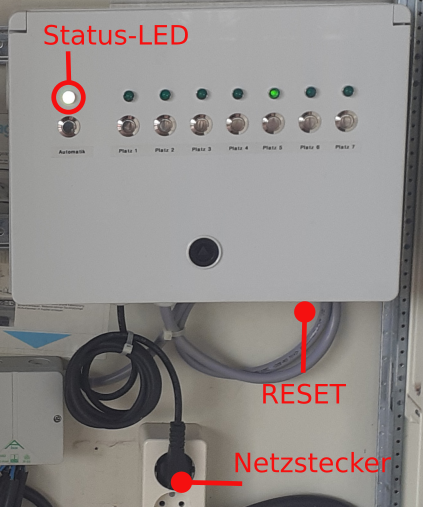
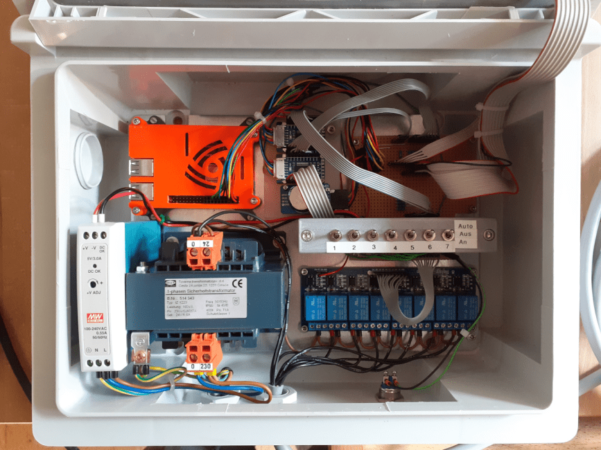
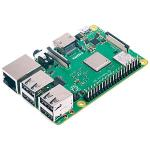
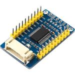
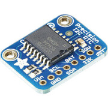

# TSGRain

H. Högl, 2020-06-05 

## Front Panel

  


  


## Needed Hardware

* 1 x Raspberry Pi 3+ (RPi3)

  

  (Reichelt)

* 2 x MCP23017 I2C I/O Expander

  

  (Reichelt)

* 1 x DS3231 RTC (I2C)

  

  The only purpose of the RTC module is to set the Linux system time on 
  startup.

  (Reichelt)

* Relais Board 

  

  (AZ Delivery)

* Power Supply for the RPi (5V)

* 9 buttons 

* 7 LEDs with mounting 

* 1 three-color LED

* 24V (AC) transformer (~ 100 W) for the magnetic valves.


## Preparation of the RPi3

* Write Linux Distribution to SD Card (currently Debian 10.3).

* Install additional tools: tmux, vim, jq, nmon, ...

* Activate WiFi Access Point (192.168.4.1), set WPA2 password

* Configure ssh access

* Install the DS3231 I2C RTC.


## Basic software architecture


TSGRain consists of two background processes, **Website** and **Steuerung**. Both 
processes are started automatically by systemd after booting the RPi3. Both are
written in the Python 3 programming language [1].

**Steuerung** is the main process which controls buttons, LEDs and outputs to
switch relais.  It controls the manual rain buttons and the automatic rain
jobs. Persistent data, e.g. the rain jobs are managed in *TinyDB*, a
small document oriented database [2]. It stores documents in the JSON
format [3]. The database can be opened and modified with any editor,
e.g. ``vim``.

**Website** is a separate process implemented using the Python *Flask* Web
Framework [4]. *Website* allows to interact with *Steuerung* by a web browser
running on a Personal Computer or a smartphone. *Website* uses the W3.CSS
stylesheets [5] to achieve a nice looking web interface independent from the
end device.

The interprocess communication (IPC) is managed with the ``BaseManager`` 
from the ``multiprocessing`` module, in combination with the ``queue`` module.

Both processes write a log file using the Python ``logging`` module.


## "Steuerung" in more detail

* The Python 3 interpreter is installed in a virtual environment 
  ``/home/pi/venv/``, the interpreter is ``/home/pi/venv/bin/python3``.

* Used for 1-minute timebase: https://pypi.org/project/schedule/

* The program can be run on a PC or on a Raspberry Pi. See ``config.py`` for
  the two variables ``USER`` and ``PLATFORM``. The PC platform ist intended
  for testing, not for production use.


## "Website" in more detail

XXX to do


## Administrator Jobs

### Login from notebook to RPi
 
  Since the RPi provides a wireless access point (SSID ``Beregnung``) the
  administrator is able to connect his notebook over WiFi.

  The administrator can login to the Raspberry with the ``ssh`` command.

  ```bash
  ssh pi@192.168.4.1 
  ```

### Control the two processes with systemd

The systemd service unit files are named ``autostart_steuerung.service`` and 
``autostart_website.service``.  Often needed commands are ``status``, 
``start``, ``stop``, ``enable`` and ``disable``.

```
sudo systemctl [command] [unitfile]
```

See also script ``etc/services.py``.

### Manually start the two processes

Start ``tmux`` with two virtual terminals.  The ``PYTHONPATH`` environment variable
is already set to ``/home/pi/tsgrain``.

Enter in terminal 1:

```
cd tsgrain
sudo --preserve-env=PYTHONPATH python3 Steuerung/main.py
```

Enter in terminal 2:

```
cd tsgrain/Website
sudo --preserve-env=PYTHONPATH python3 -m flask run --host=0.0.0.0
```

Each process can be stopped by pressing ``Control-C``.


### Look at the log files

* ``~/tsgrain/Steuerung/tsgrain.log``

* ``~/tsgrain/Website/flask.log``

### Look at the database db.json

Print the database contents in a structured way. This command uses the 
``jq`` JSON formatter [6] in a pipe.

```
cat Datenbank/db.json | jq
```

### Reboot the Raspberry Pi

```
sudo reboot now
```

or 

```
sudo shutdown -r now
```


----

[1] https://www.python.org

[2] https://tinydb.readthedocs.io

[3] https://en.wikipedia.org/wiki/JSON

[4] https://flask.palletsprojects.com

[5] https://www.w3schools.com/w3css

[6] https://stedolan.github.io/jq

----

See also my Wiki entry "Modernisierung einer Zeitsteuerung zur
Tennisplatzbewässerung"
http://hhoegl.informatik.hs-augsburg.de/hhwiki/Zeitsteuerung

